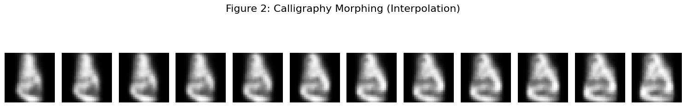

# Disentangled Variational Autoencoder (Beta-VAE) on KMNIST

This repository contains a tutorial and implementation of a **Disentangled Variational Autoencoder ($\beta$-VAE)** applied to the **Kuzushiji-MNIST (KMNIST)** dataset.

The project demonstrates how introducing a weighting parameter ($\beta$) to the KL-Divergence term of the loss function allows the model to learn disentangled, interpretable features from ancient Japanese cursive calligraphy.

## 📂 Project Structure
* **`Disentangled_VAE_KMNIST.ipynb`**: The complete Jupyter Notebook. It includes:
    * Data loading (via TensorFlow Datasets).
    * Custom `DisentangledVAE` class with overridden `train_step`.
    * Latent space visualization and interpolation experiments.

## 🚀 Key Technical Features
1.  **Beta-VAE Implementation**: Modifies the standard ELBO loss function to: $\mathcal{L} = \mathcal{L}_{recon} + \beta \cdot D_{KL}$.
2.  **Reparameterization Trick**: Custom Keras layer to handle stochastic sampling during the forward pass.
3.  **Latent Arithmetic**: Demonstrates the continuity of the latent space by "morphing" one Japanese character into another via vector interpolation.

## 📊 Results

The notebook generates two primary visualizations:
1.  **Latent Manifold**: A 2D scatter plot showing the clustering of distinct character classes.
2.  **Morphing Grid**: A visualization of the transition between character classes, proving the model has learned the structural geometry of the strokes.

## 🛠 Dependencies
* Python 3.x
* TensorFlow 2.x
* TensorFlow Datasets (TFDS)
* NumPy
* Matplotlib

## ⚙️ How to Run
1.  Open the `.ipynb` file in Google Colab (recommended for GPU acceleration).
2.  Ensure runtime is set to **T4 GPU**.
3.  Run all cells.

## 📜 License
This project is open-source and available under the MIT License.

## 🔗 Acknowledgements
* **Dataset**: KMNIST (Clanuwat et al., 2018).
* **Concept**: Beta-VAE: Learning Basic Visual Concepts with a Constrained Variational Framework (Higgins et al., 2017).
